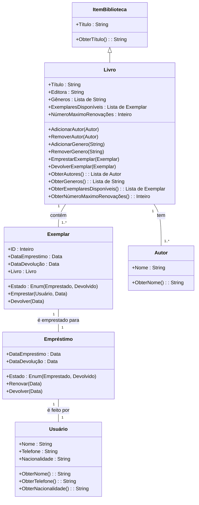

## Sistema de Gerenciamento de Biblioteca - UML

Este diagrama UML representa o sistema de gerenciamento de biblioteca, implementando conceitos de classes, herança, encapsulamento, e relacionamento entre objetos.

**Classes:**

* **ItemBiblioteca:** Classe base que representa um item da biblioteca (livro, revista, etc).
    * Atributos:
        * Título (String)
    * Métodos:
        * ObterTítulo(): String

* **Livro:** Classe que herda de ItemBiblioteca.
    * Atributos:
        * Título (String)
        * Editora (String)
        * Gêneros (Lista de String)
        * ExemplaresDisponíveis (Lista de Exemplar)
        * NúmeroMaximoRenovações (Inteiro, opcional)
    * Métodos:
        * AdicionarAutor (Autor)
        * RemoverAutor (Autor)
        * AdicionarGenero (String)
        * RemoverGenero (String)
        * EmprestarExemplar (Exemplar)
        * DevolverExemplar (Exemplar)
        * ObterAutores() : Lista de Autor
        * ObterGeneros() : Lista de String
        * ObterExemplaresDisponíveis() : Lista de Exemplar
        * ObterNúmeroMaximoRenovações(): Inteiro (opcional)

* **Autor:**
    * Atributos:
        * Nome (String)
    * Métodos:
        * ObterNome() : String

* **Exemplar:**
    * Atributos:
        * ID (Inteiro)
        * Estado (Enum: Emprestado, Devolvido)
        * DataEmprestimo (Data, opcional)
        * DataDevolução (Data, opcional)
        * Livro (Livro)
    * Métodos:
        * Emprestar (Usuário, Data)
        * Devolver (Data)

* **Usuário:**
    * Atributos:
        * Nome (String)
        * Telefone (String)
        * Nacionalidade (String)
    * Métodos:
        * ObterNome() : String
        * ObterTelefone() : String
        * ObterNacionalidade() : String

* **Empréstimo:**
    * Atributos:
        * DataEmprestimo (Data)
        * DataDevolução (Data, opcional)
        * Estado (Enum: Emprestado, Devolvido)
        * Exemplar (Exemplar)
        * Usuário (Usuário)
    * Métodos:
        * Renovar (Data)
        * Devolver (Data)

**Relações:**

* **ItemBiblioteca - Livro:** Herança. Livro é um tipo específico de ItemBiblioteca.
* **Livro "1" - "1..*" Exemplar:** Um livro pode ter vários exemplares, e um exemplar pertence a um único livro.
* **Livro "1" - "1..*" Autor:** Um livro pode ter um ou mais autores, e um autor pode escrever vários livros.
* **Exemplar "1" - "1" Empréstimo:** Um exemplar pode estar associado a um único empréstimo, e um empréstimo é associado a um único exemplar.
* **Empréstimo "1" - "1" Usuário:** Um empréstimo é feito por um único usuário, e um usuário pode ter vários empréstimos.

**Encapsulamento:**

* Os atributos de cada classe são privados, acessíveis apenas através de métodos públicos (getters e setters).
* Os métodos da classe controlam a forma como os atributos são modificados e acessados.

**Herança:**

* A classe Livro herda da classe ItemBiblioteca, reutilizando os atributos e métodos da classe base.

**Diagrama:**

**Observações:**

* O diagrama UML demonstra a estrutura básica do sistema, não incluindo detalhes específicos de implementação.
* A classe ItemBiblioteca serve como base para outros tipos de itens da biblioteca, garantindo a reutilização de código.
* O encapsulamento garante a proteção dos atributos de cada classe e a organização do código.
* A relação de herança entre ItemBiblioteca e Livro permite a criação de um sistema mais flexível e reutilizável.
* O diagrama UML serve como um guia para o desenvolvimento do sistema de gerenciamento de biblioteca, mostrando a estrutura e as relações entre as classes.
